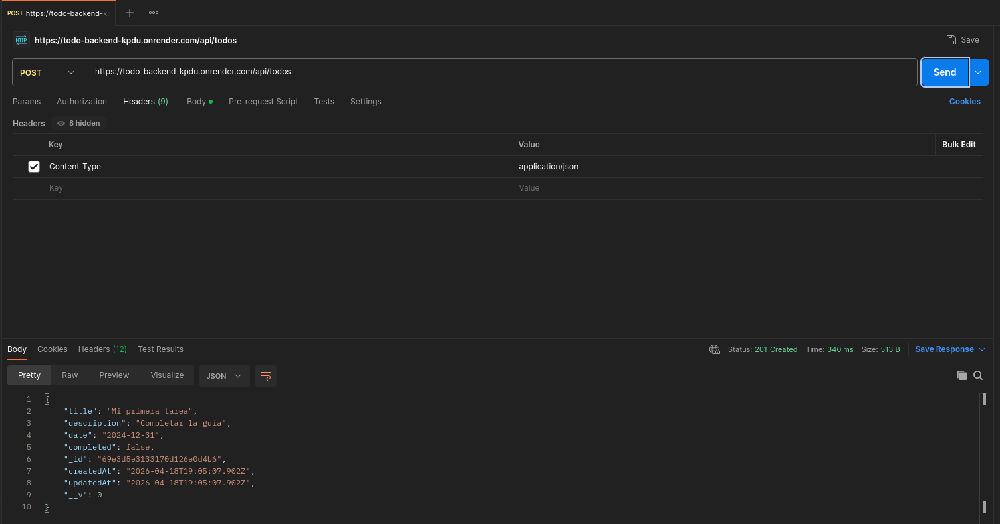

# Laboratorio 1 - TODO app backend

En este laboratorio se desarrolla una aplicación sencilla *todo* utilizando Fastify para desarrollar la API y MongoDB para asegurar conexión remota.

El servicio está desplegado en Render en la dirección `https://todo-backend-kpdu.onrender.com`.

## Ejemplo de uso

### Publicar tarea

